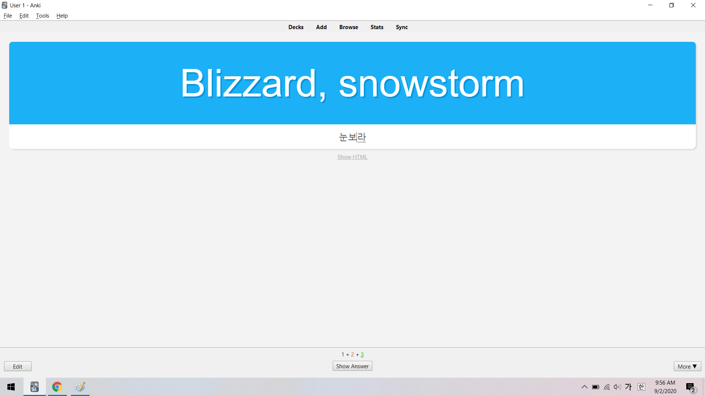
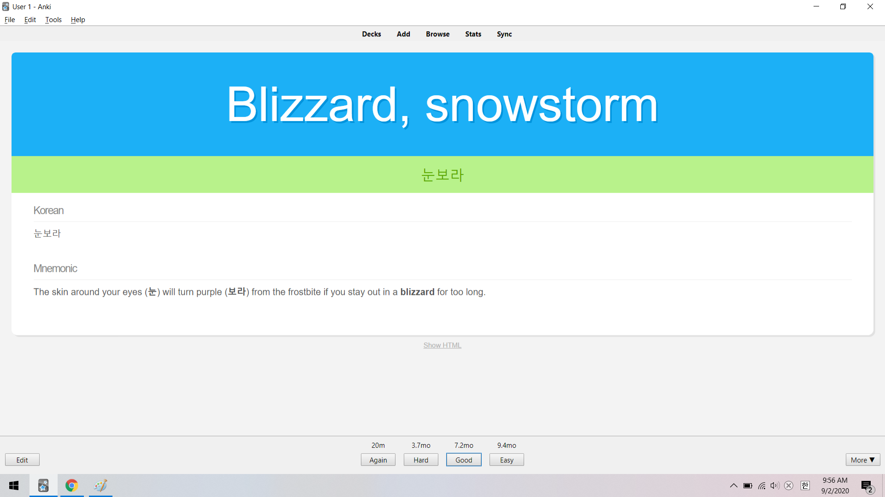

These are Anki templates I use for studying Korean vocab and sentences. Both types of [notes] have cards for recall and recognition.

[notes]: https://apps.ankiweb.net/docs/manual20.html#notes-&-fields

## Vocab

These cards are for studying vocabulary in a similar style to [WaniKani](https://www.wanikani.com/). 

### Recall

### Recognition

## Sentences

### Recall

### Recognition
